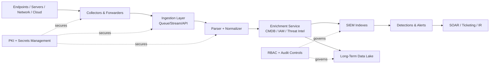
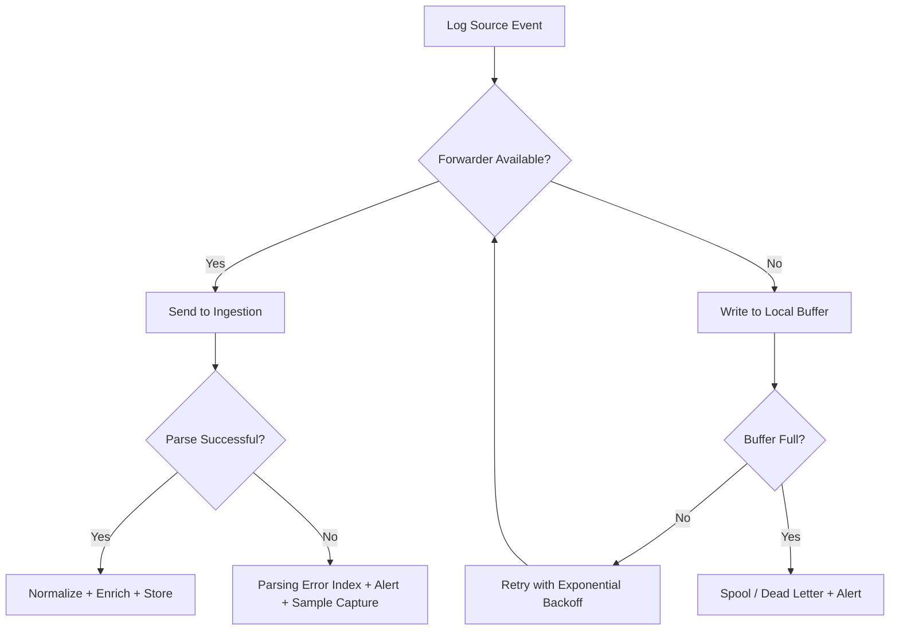
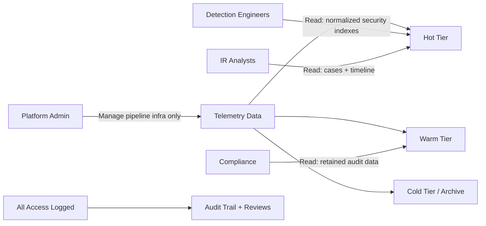

# Secure Infrastructure Observability


A practical, documentation-first blueprint for building a secure telemetry pipeline:

- **Collection** from endpoints, servers, network devices, and cloud platforms.
- **Forwarding and aggregation** with buffering, retries, and data integrity checks.
- **Normalization and enrichment** to make detections reliable and cross-source correlations possible.
- **Retention and access control** aligned with compliance and least privilege.
- **Operational runbooks** for troubleshooting and incident response support.

---

## Table of Contents

- [1) What this repository is](#1-what-this-repository-is)
- [2) Architecture at a glance](#2-architecture-at-a-glance)
- [3) End-to-end flow diagrams](#3-end-to-end-flow-diagrams)
- [4) Repository structure](#4-repository-structure)
- [5) Quick start (build the docs skeleton)](#5-quick-start-build-the-docs-skeleton)
- [6) Implementation guide](#6-implementation-guide)
  - [Step 1: Define log sources and ownership](#step-1-define-log-sources-and-ownership)
  - [Step 2: Design collection and forwarding](#step-2-design-collection-and-forwarding)
  - [Step 3: Normalize and enrich](#step-3-normalize-and-enrich)
  - [Step 4: Retention, security, and access control](#step-4-retention-security-and-access-control)
  - [Step 5: Operational runbooks](#step-5-operational-runbooks)
  - [Step 6: Validation checklist before production](#step-6-validation-checklist-before-production)
- [7) Suggested detection use-cases](#7-suggested-detection-use-cases)
- [8) KPIs / SLOs for observability quality](#8-kpis--slos-for-observability-quality)
- [9) Threat model considerations](#9-threat-model-considerations)
- [10) Tooling options by pipeline layer](#10-tooling-options-by-pipeline-layer)
- [11) Resource links](#11-resource-links)
- [12) License](#12-license)

---

## 1) What this repository is

This project is intentionally **documentation-centric**. It mirrors real SIEM/observability engineering work where architecture, policies, and runbooks are as critical as software artifacts.

Use this repository to:

1. Design a telemetry architecture that is resilient and secure.
2. Define data contracts (field mappings, parsing rules, enrichment standards).
3. Document access and retention controls.
4. Operationalize troubleshooting through runbooks and checklists.

> If you are starting from scratch, follow the [Quick start](#5-quick-start-build-the-docs-skeleton), then complete steps 1 through 6.

---

## 2) Architecture at a glance

**High-level pipeline:**

`Sources → Collectors/Forwarders → Message Bus / Aggregation → Parsing/Normalization → SIEM + Data Lake → Detections → Incident Response`

### Key design principles

- **Defense in depth:** TLS in transit, encryption at rest, scoped credentials.
- **Data quality first:** parsing confidence, schema validation, dead-letter queues.
- **Resilience:** backpressure handling, retries, local buffering, high availability.
- **Traceability:** audit logs for config changes and access requests.

---

## 3) End-to-end flow diagrams

### 3.1 Reference architecture (logical)



### 3.2 Reliability and failure handling flow



### 3.3 Access control model



---

## 4) Repository structure

> Recommended structure for this documentation project:

```text
Secure-Infrastructure-Observability/
├── docs/
│   ├── architecture/
│   │   ├── collection-design.md
│   │   ├── data-flow.md
│   │   └── trust-boundaries.md
│   ├── runbooks/
│   │   ├── collector-down.md
│   │   ├── parsing-failures.md
│   │   ├── ntp-drift.md
│   │   ├── volume-spike.md
│   │   └── missing-log-source.md
│   ├── policies/
│   │   ├── retention-policy.md
│   │   └── access-control-policy.md
│   └── inventories/
│       ├── log-source-inventory.md
│       └── owner-matrix.md
├── examples/
│   ├── normalization-rules.md
│   └── enrichment-strategy.md
└── README.md
```

---

## 5) Quick start (build the docs skeleton)

Run this from the repository root:

```bash
mkdir -p docs/{architecture,runbooks,policies,inventories} examples

touch docs/architecture/{collection-design.md,data-flow.md,trust-boundaries.md}
touch docs/runbooks/{collector-down.md,parsing-failures.md,ntp-drift.md,volume-spike.md,missing-log-source.md}
touch docs/policies/{retention-policy.md,access-control-policy.md}
touch docs/inventories/{log-source-inventory.md,owner-matrix.md}
touch examples/{normalization-rules.md,enrichment-strategy.md}
```

Optional: initialize each file with templates (headers/checklists) and track completion status in pull requests.

---

## 6) Implementation guide

## Step 1: Define log sources and ownership

Build a source inventory with event coverage and accountable owners.

### Source inventory template

| Source Class | Example Systems | Event Types | Collection Method | Owner Team | Criticality |
|---|---|---|---|---|---|
| Windows Endpoints | AD-joined workstations | Authentication, process creation, PowerShell | Agent (Winlogbeat, Splunk UF, etc.) | Endpoint SecOps | High |
| Linux Servers | App/API hosts | Syslog, auth logs, sudo, service logs | Syslog + agent | Platform Ops | High |
| Network Devices | Firewalls, routers, VPN | NetFlow/IPFIX, ACL denies, admin changes | Syslog/exporter | NetOps | High |
| Cloud Control Plane | AWS CloudTrail / Azure Activity / GCP Audit | IAM, API calls, policy changes | Native APIs / connectors | Cloud SecOps | High |
| Identity Providers | Entra ID / Okta | Sign-in, MFA challenges, risk events | API polling / webhook | IAM Team | High |

### Minimum source requirements

- A named owner and escalation path.
- A data classification label.
- An expected events-per-second baseline.
- Documented collection SLA (e.g., P95 ingestion < 60 seconds).

---

## Step 2: Design collection and forwarding

Document the ingestion architecture in `docs/architecture/collection-design.md`.

### Collection design checklist

- Forwarder topology (agent-per-host, sidecar, gateway collector).
- Protocols and ports (syslog TLS, HTTPS, Kafka, etc.).
- Retry/backoff policy and local disk buffering limits.
- Maximum tolerable data loss (RPO for telemetry).
- Certificate management and secret rotation lifecycle.

### Security controls to include

- **mTLS** between forwarders and ingestion endpoints.
- Host identity attestation where supported.
- Signed config bundles and controlled rollout.
- Change-control records for parser/forwarder config.

---

## Step 3: Normalize and enrich

Define a common schema for cross-source analytics.

### Core normalized fields

- `@timestamp`
- `event.dataset`
- `event.category`
- `event.action`
- `host.name`
- `host.ip`
- `user.id`
- `user.name`
- `source.ip`
- `destination.ip`
- `process.name`
- `process.command_line`
- `cloud.account.id`

### Enrichment recommendations

- CMDB asset criticality / business owner.
- Identity context (privilege level, department, MFA status).
- Threat intelligence indicators and confidence level.
- GeoIP / ASN metadata for external IPs.

### Data quality gates

- Parse success rate threshold (e.g., >99%).
- Field completeness checks for high-value logs.
- Schema drift alarms when new/unknown fields explode.

---

## Step 4: Retention, security, and access control

Document policy in `docs/policies/retention-policy.md` and `docs/policies/access-control-policy.md`.

### Example retention tiers

| Tier | Typical Duration | Use Case | Storage Characteristics |
|---|---:|---|---|
| Hot | 7–30 days | Active investigations and detections | Fast query, high cost |
| Warm | 30–180 days | Trend analysis, delayed investigations | Moderate performance/cost |
| Cold/Archive | 180+ days to years | Compliance, forensics, legal hold | Low cost, slower retrieval |

### Access control model

- Least privilege via role-based access controls.
- Separation of duties (platform admins vs analysts).
- Just-in-time elevated access for sensitive data.
- Mandatory audit logging for access and exports.

### Encryption standards (recommended)

- TLS 1.2+ in transit.
- AES-256 (or provider equivalent) at rest.
- Customer-managed keys where feasible.

---

## Step 5: Operational runbooks

Create runbooks under `docs/runbooks/` for the scenarios below:

1. **Collector down**
2. **Parsing failures spike**
3. **NTP/time sync drift**
4. **Unexpected volume increase**
5. **Missing critical log source**

### Runbook template

- **Symptoms** (dashboards, alerts, user impact)
- **Initial triage** (health checks, recent deploys, cert status)
- **Root cause hypotheses**
- **Resolution steps** with rollback option
- **Post-incident actions** (RCA, preventive controls)

---

## Step 6: Validation checklist before production

Use this checklist before go-live:

- [ ] All Tier-0/Tier-1 log sources reporting.
- [ ] Clock sync validated across all collectors and sources.
- [ ] Parse success and schema quality thresholds met.
- [ ] Retention tiers applied and verified.
- [ ] RBAC tested with least privilege personas.
- [ ] Sensitive fields redaction/tokenization verified.
- [ ] Detection smoke tests generate expected alerts.
- [ ] Audit trail for admin access verified.

---

## 7) Suggested detection use-cases

Start with these high-value detections once normalized data is stable:

- Impossible travel / anomalous sign-in behavior.
- Privilege escalation and suspicious admin role changes.
- Unusual process execution on critical hosts.
- Excessive authentication failures and brute force patterns.
- Data exfiltration indicators (large egress, uncommon destinations).

---

## 8) KPIs / SLOs for observability quality

Track pipeline health using measurable objectives:

- **Ingestion latency (P95):** source event to searchable index.
- **Parse success rate:** percentage of events parsed without fallback.
- **Coverage ratio:** critical sources sending expected volume.
- **Alert fidelity:** precision/recall trend for top detections.
- **MTTR for pipeline incidents:** from alert to restored ingestion.

---

## 9) Threat model considerations

Protect against common telemetry pipeline risks:

- Log tampering at source.
- Credential theft for forwarders/connectors.
- Data poisoning through malformed events.
- Insider misuse of sensitive telemetry.
- Blind spots caused by disabled agents or API quota failures.

Mitigations should be documented as controls mapped to architecture components.

---

## 10) Tooling options by pipeline layer

Examples (non-exhaustive):

- **Collectors/agents:** Fluent Bit, Vector, Beats, OpenTelemetry Collector.
- **Transport/buffer:** Kafka, Kinesis, Pub/Sub, Event Hubs.
- **Processing:** Logstash, Fluentd, stream processors, SIEM-native pipelines.
- **Storage/analytics:** Splunk, Elastic, Sentinel, Chronicle, data lake platforms.
- **Orchestration/response:** SOAR platforms, ticketing integrations, runbook automation.

Choose tools based on throughput, reliability, compliance obligations, and team expertise.

---

## 11) Resource links

### Standards and frameworks

- NIST Cybersecurity Framework (CSF): https://www.nist.gov/cyberframework
- NIST SP 800-92 (Guide to Computer Security Log Management): https://csrc.nist.gov/publications/detail/sp/800-92/final
- CIS Controls v8: https://www.cisecurity.org/controls/v8
- ISO/IEC 27001 overview: https://www.iso.org/isoiec-27001-information-security.html

### Detection and telemetry references

- MITRE ATT&CK Data Sources: https://attack.mitre.org/datasources/
- MITRE ATT&CK Techniques: https://attack.mitre.org/techniques/enterprise/
- OpenTelemetry: https://opentelemetry.io/
- Elastic Common Schema (ECS): https://www.elastic.co/guide/en/ecs/current/index.html

### Cloud audit logging docs

- AWS CloudTrail: https://docs.aws.amazon.com/awscloudtrail/latest/userguide/cloudtrail-user-guide.html
- Azure Activity Logs: https://learn.microsoft.com/azure/azure-monitor/essentials/activity-log
- GCP Cloud Audit Logs: https://cloud.google.com/logging/docs/audit

### Operational guidance

- SANS Incident Handler’s Handbook (landing page): https://www.sans.org/white-papers/33901/
- Google SRE Workbook (monitoring/operations concepts): https://sre.google/workbook/table-of-contents/

---

## 12) License

MIT
